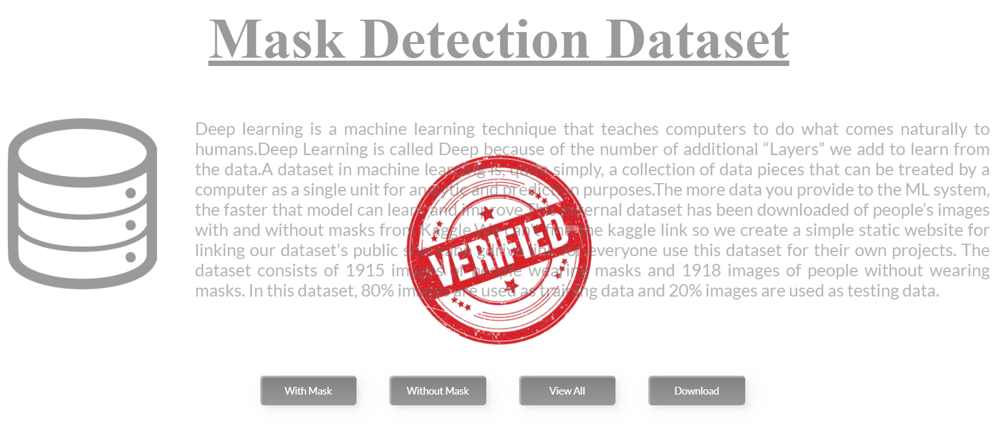

# FMD-DATASET-STATIC-WEBSITE :star_struck: :memo: :file_folder: :computer:

[](https://shields.io/) [](https://shields.io/) 

***This new WebSite named 'FMD-DATASET-STATIC-WEBSITE' is created by Biswarup Bhattacharjee, student of BTECH, in University of Engineering and Management, Kolkata.***

**Email Id: bbiswa471@gmail.com.** 

**Contact No: 916290272740.** 

<p align="left">
<a href="https://www.facebook.com/profile.php?id=100070395300810" target="blank"></a>
<a href="https://instagram.com/biswarup2210" target="blank"></a>
<a href="https://github.com/biswa2210/biswa2210" target="blank"></a>
</p>

## About :point_down: 

<div align="justified">
  
This is a website which contains description about dataset of Mask Detection System. This dataset contains 1915 images of people with mask and 1918 images of people without mask. The dataset has been uploaded in google drive then the links are attached with the buttons given below with mask, withou mask, view all, download.
   
</div>
 
## LINK : :point_right: https://urlzs.com/xYrkr

## Purpose :point_down:

<div align="justified">

I have made this website to provide the dataset link in a research paper of my project mask detection system.

</div>

## Use :point_down:

<div align="justified">

We just have to click on the buttons to access the dataset of with mask, without mask.

</div>      

## Folder Structure :point_down:
```bash
FMD-DATASET-STATIC-WEBSITE
            ├── index.html
            └── dataset.css
```

## Making :point_down:

<div align="justified">
  
I have made this website with html and css.

</div>

## Screenshots :point_down: 

<div align="center">

<a href="md1.PNG"></a> 
  
</div>


